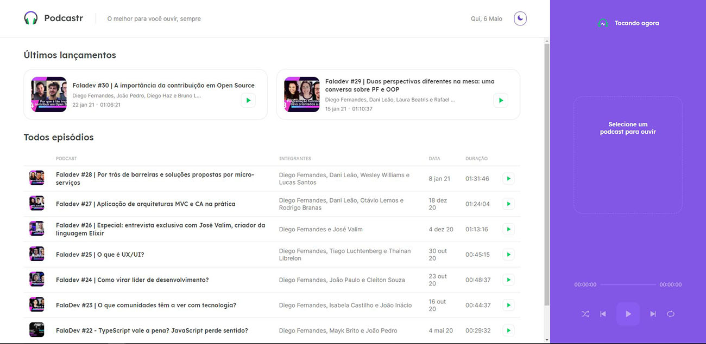
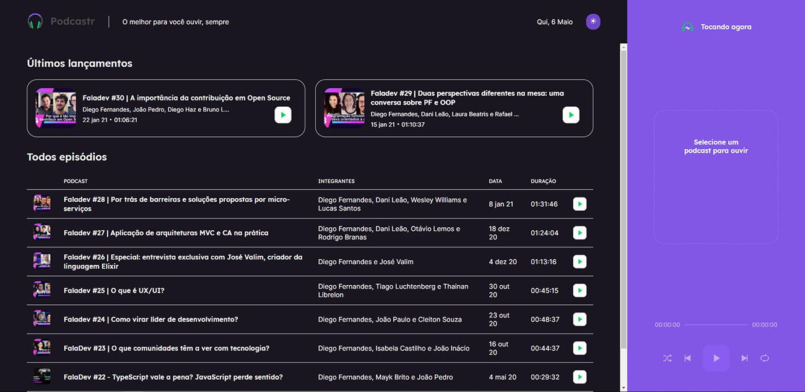
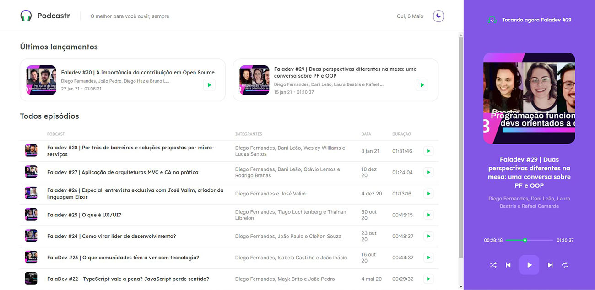
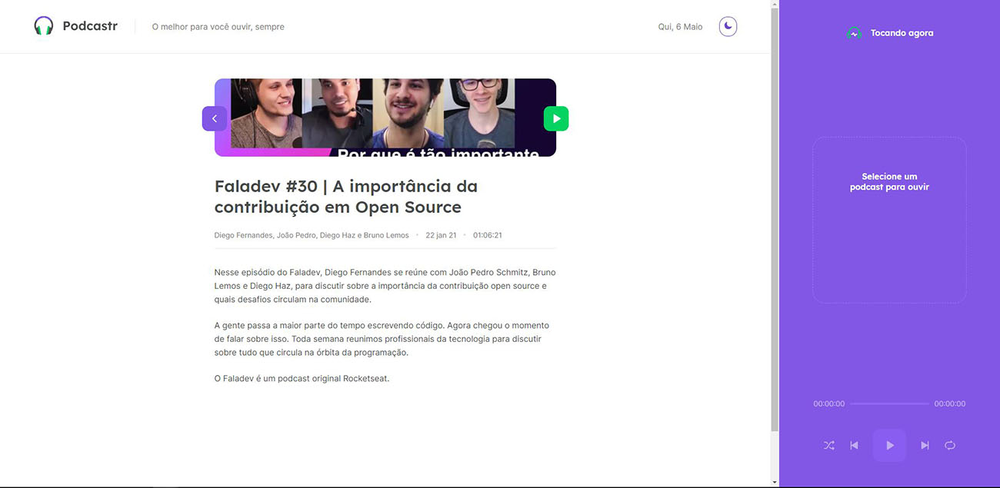
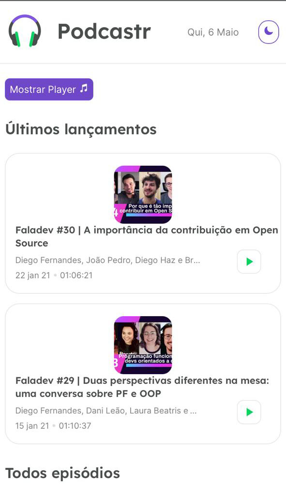
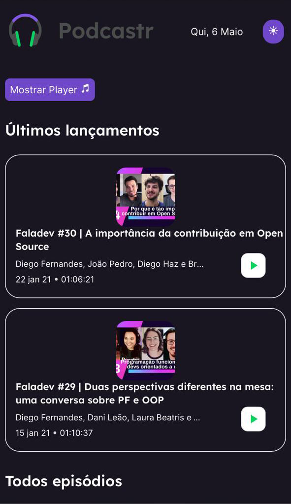
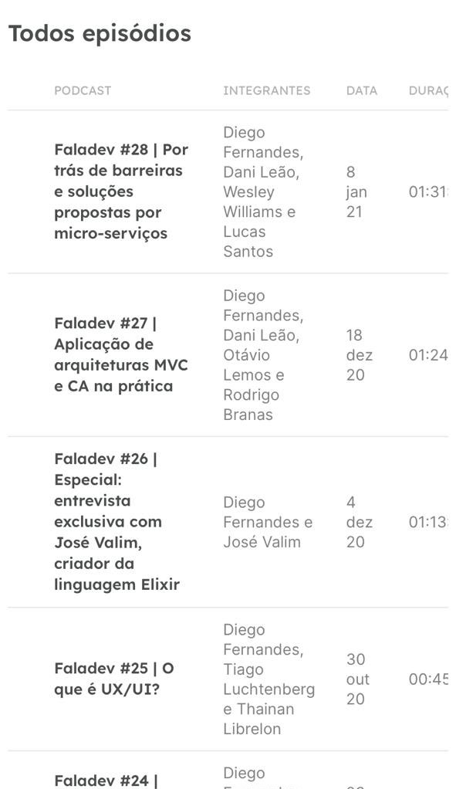
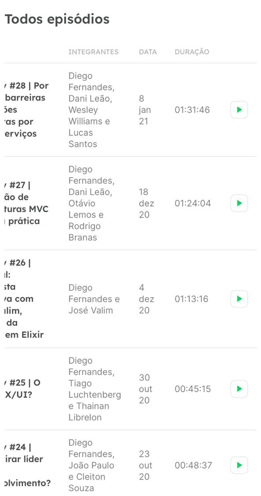
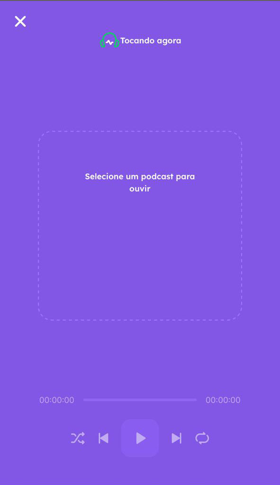
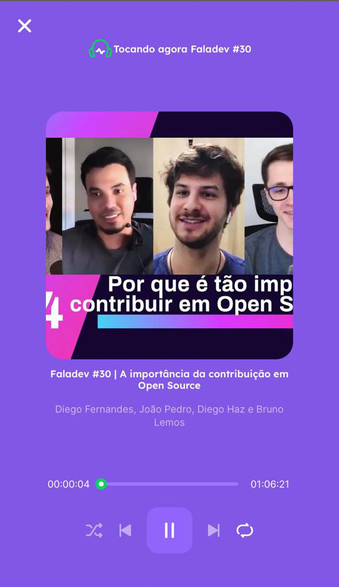

<h1 align="center">
     
</h1>

<p align="center">  
 Podcastr é um projeto desenvolvido durante a NLW#5 "Next Level Week #5" da Rocketseat que foi realizado dentro de uma semana. 
</p>

<p align="center">Você pode visualizar o resultado do projeto nesse <a href="https://podcastnextjs.vercel.app/">link</a>.</p>

<h4 align="center">
	🚧 Desenvolvimento 🚀 🚧
</h4>

Tabela de conteúdos
=================
<!--ts-->
   * [Sobre o projeto](#-sobre-o-projeto)
   * [Layout](#-layout)
     * [Web](#web)
     * [Mobile](#mobile)
   * [Como executar o projeto](#-como-executar-o-projeto)
   * [Tecnologias](#-tecnologias)
   * [Licença](#user-content--licença)
<!--te-->


## 💻 Sobre o projeto

<p>O projeto é basicamente uma listagem dos episódios de podcasts da Rocketseat onde consumimos todas as informações via API, cada episódio possui uma pagina própria com mais detalhes sobre o episódio.</p>
<p>E por ultimo, porém não menos importante temos um player construído com todos os recursos que o HTML nos oferece com as funções básicas de qualquer player, que são: play, pause, próximo, anterior, deixar em ordem aleatória e repetir.</>

## 🎨 Layout

### Web

<p align="center" style="display: flex; align-items: flex-start; justify-content: center;">
  
  
  
  
  
</p>

### Mobile

<p align="center" style="display: flex; align-items: flex-start; justify-content: center;">
  
  
  
  
  
  
</p>

## 🚀 Como executar o projeto

Este projeto pode ser executado apenas com esse repositorio, porém a API fiz o deploy na <a href="https://www.heroku.com/">Heroku</a> separado desse repositório:

💡O Frontend precisa que o Backend esteja sendo executado para funcionar.

### Pré-requisitos

Antes de começar, você vai precisar ter instalado em sua máquina as seguintes ferramentas:
[Git](https://git-scm.com), [Node.js](https://nodejs.org/en/). 
Além disto é bom ter um editor para trabalhar com o código como [VSCode](https://code.visualstudio.com/)

#### Rodando a aplicação web (Frontend)

```bash

# Clone este repositório
$ git clone https://github.com/Tuhh16/podcastnextjs.git

# Acesse a pasta do projeto no seu terminal/cmd
$ cd podcastnextjs

# Instale as dependências
$ yarn install

# Execute a aplicação em modo de desenvolvimento
$ yarn dev

# A aplicação será aberta na porta:3000 - acesse http://localhost:3000

# Para iniciar o backend basta iniciar o json server seguindo os seguintes passos

# Acesse a pasta do projeto no seu terminal/cmd
$ cd podcastnextjs

# Execute a aplicação em modo de desenvolvimento
$ yarn server

# A aplicação será aberta na porta:3333 - acesse http://localhost:3333

```

---

## 🛠 Tecnologias

As seguintes ferramentas foram usadas na construção do projeto:

-   **[ReactJs](https://pt-br.reactjs.org/)**
-   **[NextJs](https://nextjs.org/)**
-   **[TypeScript](https://www.typescriptlang.org/)**

> Veja o arquivo  [package.json](https://github.com/Tuhh16/podcastnextjs/blob/master/package.json)

---

## 📝 Licença

Este projeto esta sobe a licença [MIT](./LICENSE).

Feito por Arthur Teodoro Alves de Lima 👋🏽 [Entre em contato!](https://www.linkedin.com/in/arthur-lima-reactjs/)
